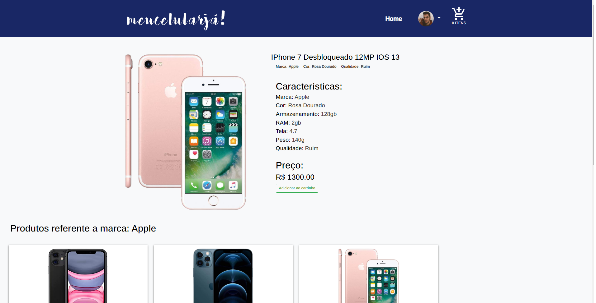

# eCommerceCell

# Projeto feito com PHP (não orientado a objetos)</h1>

##### Trabalho de conclusão do 2° semestre do curso de Desenvolvimento de sistema da Etec de São Roque, Matéria PHP (não orientado), trabalho de uso didático!!!

### Envolvendo telas (para usuários), como:

    *  Login/Cadastrar novo usuário/Esqueceu senha;
    *  Index (Navegação global, perfil usuário, cards de produtos e produtos por marca;
    *  Perfil de usuário, podendo (alterar foto, nome, senha e inativar conta);
    *  Clique no produto e características do produto clicado (também 'categoria' por marca clicada);
    *  Carrinho com produtos adicionados, podendo remover o(s) produto(s);

### Para adiminstradores no sistema:
    *  Login/Cadastrar novo usuário e administrador/alterar senha de usuarios e administradores, inativar ou eleger 'nivel' de conta de usuários;
    *  Index (Navegação global, perfil usuário, cards de produtos e produtos por marca, além do painel administrativo;
    *  Cadastros de produtos, usuario/adms, carrossel de imagens;
    *  Consulta de produtos, carrossel, usuários no sistema;
    *  Consulta inclui (exclusão, alteração de dados e alteração de foto;
    *  Além de que o Adm poderá simular uma venda como um usuário.
    *  Perfil de Aministrador, podendo (alterar foto, nome, senha e inativar conta);
    *  Clique no produto e características do produto clicado (também 'categoria' por marca clicada);
   *  Carrinho com produtos adicionados, podendo remover o(s) produto(s);

##### Este projeto foi um projeto final de conclusão de 2° semestre do curso técnico de desenvolvimento de sistema da etec de São Roque

##### Um projeto feito por @WesleyRodrigues55 e @RicieriJM

## Código disponibilizado para consulta</h5>

